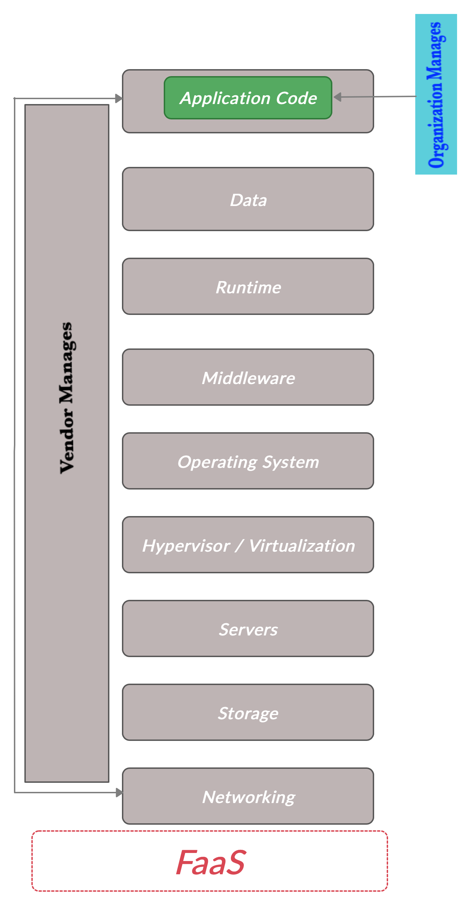

# AWS SAM - Serverless Application Model

Walkthrough building and testing [AWS Serverless Application Model](https://aws.amazon.com/serverless/sam/ "AWS SAM") using AWS SAM CLI and [LocalStack](https://github.com/localstack/localstack "LocalStack") locally. Image API Serverless Application incorporates AWS Serverless Application Model (SAM) for image processing implemented as Nodes JS Lambda Function and exposed via API Gateway Endpoint. The Image API stores image details in DynamoDB and images on S3.

## TLDR;

We explore what is Serverless ? and walk through a simple image sampling serverless application. We develop and test the application locally using LocalStack to mock AWS services not needing an AWS account. This helps when we do not want to incur cost on AWS for quick tests.  

## What is Serverless ?

Before we answer what is Serverless, let's explore the following fundamentals - On Premise, IaaS, PaaS and SaaS.


### On Premise

On Premise is the traditional IT infrastructure setup. IT solutions runs on infrastructure within the premise of the organization. Organizations host and manage all the infrastructure in house within data centers. On Premise environments require high up front capital expenditures (CAPEX) and on going operational cost (OPEX). Organizations are responsible for maintaining all aspects of IT solutions and all its related processes and manages entire stack from Networking to  Applications deployed on them.

### Infrastructure as a Service (IaaS)

Infrastructure as a Service (IaaS) is computing infrastructure, provisioned and managed over the Internet. IaaS allows to provision or decommission resources instantaneously. Organization need not risk up front CAPEX to try out an idea or validate new product in the market. IaaS allows On Demand infrastructure. All prominent cloud providers provide IaaS services. In IaaS vendor provides infrastructure and manages underlying hardware, networking and storage components. The organization is responsible for the software that runs on the infrastructure and applications installed on them. IaaS follows a pay as you go offering, organization pays for the infrastructure they consume. Examples: AWS CloudFormation, AWS EC2, Amazon S3, Google Compute Engine.

### Platform as a Service (PaaS)

Platform as a service (PaaS) offering delivers a complete end to end platform to organizations. The organizations only focus on building applications and running them on the platform. The PaaS vendor manages the underlying infrastructure including hardware, networking, storage, operating systems and virtualization. Organizations solely focus on business applications and execute them on the platform. Examples: AWS Elastic Beanstalk, Windows Azure.

### Software as a Service (SaaS)

Software as a Service (SaaS) offering delivers a complete end to end software generally offered through a subscription model. Organization uses the software to perform its business function, this is similar to Commercial off-the-shelf (COTS) software where organization would install and manage these On Premise. SaaS allows to consume the same software over the internet and manages all aspects of the software, organizations can configure and use the software to suite their business needs. Examples: DropBox, Salesforce, Google WorkSpace.

### Serverless, Function as a Service (FaaS)

Serverless or Function as a Service (FaaS) is an offering similar to PaaS in the sense that organization manages application code and vendor manages underlying infrastructure however  vendor also responsible for instantiating application code execution. The organization configures events that trigger application code execution. The FaaS service initializes an execution environment for application code to process events and disposes execution environment when there are no events to process. Cost is incurred only for processing time of application code. This further optimizes OPEX and one pays only for processing time of the application code. Example: AWS Lambda, Google Cloud Functions.



## AWS SAM - Serverless Application Model

[AWS Serverless Application Model](https://aws.amazon.com/serverless/sam/ "AWS SAM") is an AWS specific framework for building serverless applications in the AWS ecosystem. AWS SAM provides a shorthand syntax for defining AWS Lambda, Amazon API Gateway,AWS S3, AWS DynamoDB and other [Serverless Services](https://aws.amazon.com/serverless/ "Serverless Services"). This shorthand syntax is called the [SAM Template](https://docs.aws.amazon.com/serverless-application-model/latest/developerguide/sam-specification-template-anatomy.html "SAM Template"). This SAM template expands and gets converted into CloudFormation syntax during deployment. [CloudFormation](https://aws.amazon.com/cloudformation/ "CloudFormation") is a more verbose templating syntax to provision resources on AWS.

AWS SAM supports widely used languages for serverless code execution - nodejs, java, go, python, dotnetcore and ruby.

To get started with AWS SAM we need to install [AWS SAM CLI](https://docs.aws.amazon.com/serverless-application-model/latest/developerguide/serverless-sam-cli-install-mac.html "AWS SAM CLI").

SAM CLI requires Docker to be available in the local machine for local invocation and testing on the serverless code.

Basic AWS SAM CLI commands:

- sam init
  - init generates preconfigured AWS SAM template and example application. This creates required scaffolding to get started and plug away.
  
    

- sam local invoke
  - local invoke allows for local invocation of the serverless application, sam local invoked requires a json file which dictates arguments passed to the serverless function. SAM local generate-event facilitates generating event file which can be updated as needed. sam local invoke deploys serverless application to a docker container, processes event and disposes off the container.

    

    

- sam local start-api
  - local start-api simulates actual running of serverless function. Start api listens for configured events and mounts serverless application to a docker container for event processing, it does this multiple times as it receives events.

    

    *We talk about "--docker-network bridge --env-vars env.json" later, as we discuss LocalStack.*  

- sam deploy
  - deploy will deploy sam application to AWS. Sam deploy requires valid AWS account and valid AWS CLI configuration.

    

## LocalStack

[LocalStack](https://github.com/localstack/localstack "LocalStack") is a fully functional local AWS cloud stack, this is an easy to use local test and mocking framework without needing an AWS account. This helps to keep cost down by doing local testing without needing to provision AWS resources until we are ready to deploy.

LocalStack runs in a docker container and requires docker to be available on local machine.

After installing LocalStack, best way to get up and running is to use docker-compose file, this allows for fine control on services we need to mock and data folders for our testing.

In the case of ImageAPI serverless application we are using S3 and DynamoDB and configure for those.


LocalStack exposes port 4566 for mocked AWS services.

When we run sam local start-api we want our serverless application to interact with LocalStack mock services instead of reaching out real AWS services. We achieve this by specifying --docker-network bridge to instruct SAM docker container to share same network as LocalStack, we also configure --env-vars env.json to override endpoint environment variable to use LocalStack mock services instead of real AWS services.

```
sam local start-api --docker-network bridge --env-vars env.json
```

With this set up we can build and test AWS Serverless application using LocalStack for mocking AWS services and sam local start-api to simulate AWS Serverless stack.

## Image API Application

The ImageAPI serverless application resizes images by wrapping [Sharp](https://sharp.pixelplumbing.com "Sharp") image processing library. The serverless application is a Lambda function triggered by API Gateway events. The POST events to the function processes base64 image and returns resized image. Image details are stored to DynamoDB while original and resized images are stored in Amazon S3. Get events read details for DynamoDB to display list of processed images, original and resized images can be retrieved from S3. Finally Delete event is used to clean up S3 and DynamoDB.

Not production grade, none the less fair representation of a serverless application model and getting started locally with SAM.


ImageAPI serverless application contains the following.

- imageapi -
  This contains lambda function for serverless execution.
  
- imageclient -
  This is a simple react client application for calling serverless application

- localstack -
  This contains localstack docker compose file and script for creating mock AWS resources.

- build/run scripts -
  buildSAM and runSAMLocal are scripts to build and run the serverless application locally.

- template.yaml -
  This is the ImageAPI SAM template.

- env json -
  This is used to override environment variables for the serverless application. We override the endpoint configuration to point to localstack running locally.

- event.json -
  This is used to mock events sent to serverless application for sam invoke action.

- Serverless-ImageAPI.postman_collection.json -
  Postman collection for running tests via [Postman](https://www.postman.com "Postman").


### ImageAPI SAM Template

We look at sections that make up ImageAPI SAM Template.

- Globals, define parameters that are applied globally to resource types defined in template. In the case of ImageAPI we define each resource type only once, so these could have also been defined with the resource type instead of global.

```
Globals:
  Function:
    Timeout: 3
```

- DynamoDB definition, here we define resource for DynamoDB. The Attribute definitions, key and provisioned throughputs for read and write.
  
```
ImageAPIDBTable:
    Type: AWS::DynamoDB::Table
    Properties:
      TableName: Images
      AttributeDefinitions:
        - AttributeName: id
          AttributeType: S
      KeySchema:
        - AttributeName: id
          KeyType: HASH
      ProvisionedThroughput:
        ReadCapacityUnits: 1
        WriteCapacityUnits: 1
```

- API Gateway definition, which defines endpoint configuration, supported binary media types so we can return resized image as binary image. We also specify Authentication type as API key. This way any requests that do not contain the x-api-key header will be rejected.

```
ImageAPI:
    Type: AWS::Serverless::Api
    Properties:
        EndpointConfiguration:
            Type: REGIONAL
        StageName: Prod
            BinaryMediaTypes:
                - image~1png
        Auth:
            ApiKeyRequired: true
```

- API Key definition, which defines api key that should be used as Auth header and evaluated by API Gateway.
  
```
ImageAPIKey:
    Type: AWS::ApiGateway::ApiKey
    DependsOn: [ImageAPIUsagePlan]
    Properties:
      Enabled: true
      GenerateDistinctId: false
      Name: "IMAGE-API-KEY"
      Value: "IMAGEAPIKEY20210206SERVERLESS"
      StageKeys:
        - RestApiId:
            Ref: ImageAPI
          StageName: Prod
```

- Lambda Function definition, which defines lambda runtime, code and applicable policies to interact with S3 and DynamoDB. API Gateway events are configured which will trigger execution of the lambda function.
  
```
ImageAPIFunction:
    Type: AWS::Serverless::Function
    Properties:
      CodeUri: imageapi/
      Handler: app.lambdaHandler
      Runtime: nodejs12.x
      Timeout: 60
      Policies:
        - S3CrudPolicy:
            BucketName:
              Ref: ImageAPIBucket
        - DynamoDBCrudPolicy:
            TableName:
              Ref: ImageAPIDBTable
      #Defined to facilitate LocalStack local testing
      #This is overwritten only for sam local start-api vis env.json
      Environment:
        Variables:
          LOCALSTACK_ENDPOINT: ""
      Events:
        ImagesGetAll:
          Type: Api
          Properties:
            RestApiId:
              Ref: ImageAPI
            Path: /images
            Method: get
            RequestParameters:
              - method.request.querystring.imageid
            Auth:
              ApiKeyRequired: true
```

### ImageAPI Lambda Function

The lambda function configures required AWS resources and endpoints in the configureAWS method and then processes request to resize or list images.

```
...
...
exports.lambdaHandler = async (event, context) => {
    try {

        //Configure AWS DynamoDB and S3 Clients
        configureAWS();

        if (!event || !event.httpMethod) {
            return getLambdaResponse(400, getStatusResponse(400, "Invalid Request, please specify valid imageapi request"));
        }

        switch (event.httpMethod.toUpperCase()) {
            ....
            ....
            ....

```

The configureAWS() function defaults to US-EAST-2 AWS region and checks for the LOCALSTACK_ENDPOINT override in which case it uses the localstack mock AWS services. 


```
configureAWS = () => {
    //Defaut to us-east-2
    AWS.config.update(
        {
            region: "us-east-2"
        }
    );

    //Check Environment Variable for LocalStack local testing
    if (process.env.LOCALSTACK_ENDPOINT && process.env.LOCALSTACK_ENDPOINT.length > 0) {
        console.log("LocalStack local testing if effect.");
        console.log("LocalStack EndPoint: ", process.env.LOCALSTACK_ENDPOINT);
        AWS.config.update(
            {
                region: "us-east-2",
                endpoint: process.env.LOCALSTACK_ENDPOINT
            }
        );
    }

    //Configure DynamoDB client
    dynamoDBClient = new AWS.DynamoDB.DocumentClient();

    //Configure S3 client
    S3 = new AWS.S3(
        {
            apiVersion: '2006-03-01',
            sslEnabled: false,
            s3ForcePathStyle: true
        }
    );
};
```

### Building and Running ImageAPI Locally

- Run buildSAM.sh script to build serverless application, build uses -u option to run build in a docker container by pulling the configured runtime environment for the serverless application.

    

- Start LocalStack via docker-compose
  
    

- Run runSAMLocal script to start ImageAPI serverless application locally.

    

- Validate via PostMan RestClient. Configure x-api-header for request and execute request with base64 image details.
  
    

    

    

    

- Simple react based client contained in imageclient can be built and run for a UI application that interacts with the ImageAPI serverless application.

    

### SAM Deploy

Deploying ImageAPI Serverless Application to AWS is simplified by running *sam deploy --guided* command.

SAM deploy guided will prompt for configuration like stack name regions, validation and  utilize CloudFormation under the hood to deploy serverless application. Lambda code will be uploaded to S3 and AWS resources will be provisioned.

  

  

  

  

  

  

  

The react UI client can be updated pointing to PROD api gateway stage and execute api calls to image processing serverless application on AWS.

Clean up CloudFormation stack using -
```
aws cloudformation delete-stack --stack-name imageapi
```

Please validate from console that stack is deleted, sometimes delete process fails resulting in unreleased resources.
### Gotchas:

- CORS

In case of Lambda Proxy Integration, Lambda function must set CORS headers. We should not define CORS headers on API Gateway.

```
getLambdaResponse = (statusCode, responseObj) => {
    return {
        "statusCode": statusCode,
        "headers": {
            "Content-Type": "application/json",
            "Access-Control-Allow-Origin": "*",
            "Access-Control-Allow-Credentials": true,
            "Access-Control-Allow-Methods": "GET,POST,DELETE,OPTIONS",
            "Access-Control-Allow-Headers": "Content-Type,X-Amz-Date,Authorization,X-Api-Key,X-Amz-Security-Token",
        },
        "body": JSON.stringify(responseObj)
    };
};
```

- API Key and HTTP OPTIONS request

Browsers will initiate CORS Preflight request with OPTIONS method. We need to skip API key validation in case of OPTIONS in the SAM template else browser will not get past the CORS validations.

```
Events:
  ImagesOption:
    Type: Api
    Properties:
      RestApiId:
        Ref: ImageAPI
      Path: /images
        Method: options
        Auth:
          ApiKeyRequired: false
```
